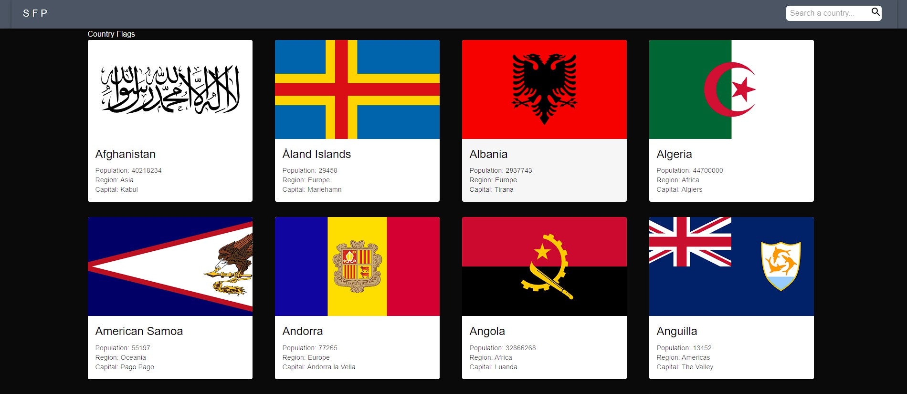
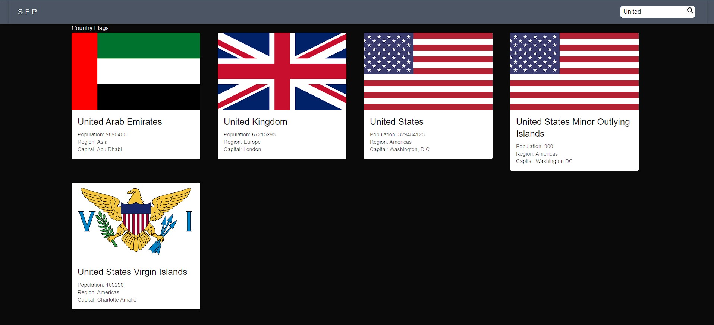

Hello again guys!
Tech priest here with new project which is about useing api.

this is simple project which i did to learn how to call and use api , sort data, search on them.

note that the Nabara componet is useless...but i can't delete that :D
